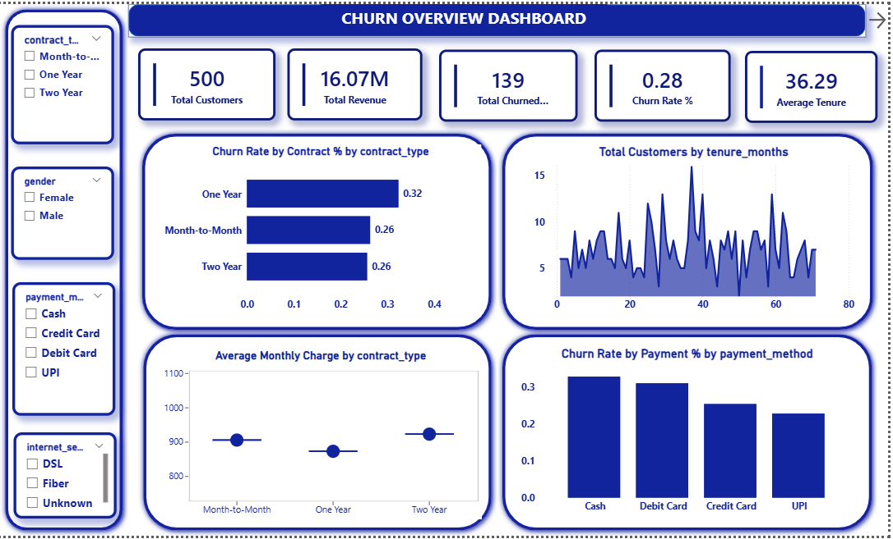
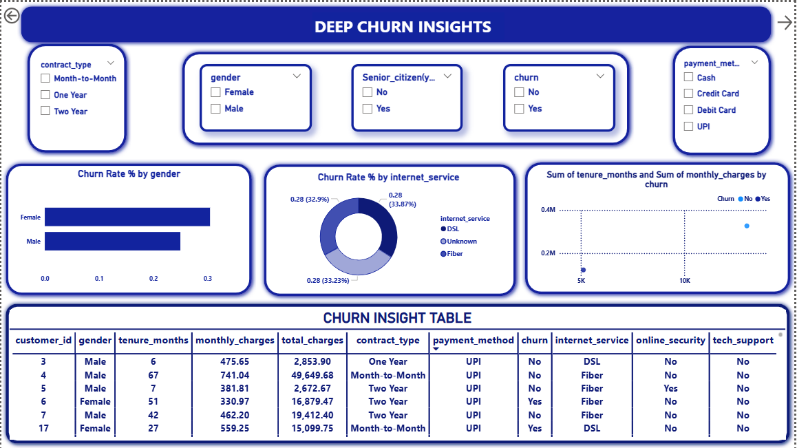
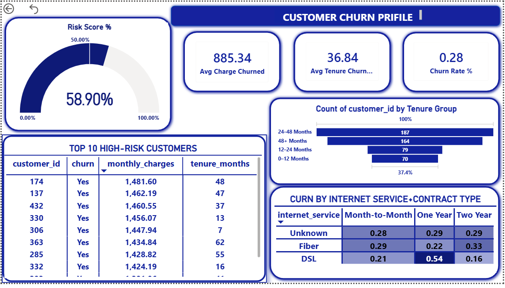

# Customer Churn Analysis Project
## 1] Project Overview

Customer churn analysis helps identify why customers leave a service and which factors contribute most to churn.
The primary objective of this project is to analyze customer churn patterns and provide actionable business insights to improve customer retention.

This end-to-end analytics project uses Python, SQL, and Power BI and delivers a 3-page interactive Power BI dashboard along with analytical insights and business recommendations.

## 2] Objectives

- Identify key factors influencing customer churn

- Analyze churn behavior across contracts, payments, tenure, and services

- Build an interactive dashboard for decision-makers

- Provide data-driven business recommendations to reduce churn

## 3] Dataset Overview

- Domain: Telecom Customer Data

- Rows: 500

- Columns: 13

### Key Columns
## Column Name	    Description
- customer_id	        Unique customer identifier
- gender	            Customer gender
- senior_citizen	    1 = Yes, 0 = No
- tenure_months	        Customer tenure in months
- internet_service	    Fiber / DSL / None
- payment_method	    Credit Card / Debit Card / UPI / Cash
- contract_type	        Month-to-Month / One Year / Two Year
- monthly_charges	    Monthly billing amount
- total_charges	        Total charges
- online_security	    Yes / No
- tech_support	        Yes / No
- is_active	            Yes / No
- churn	                Yes / No

The dataset used in this project is synthetically generated to simulate fraud detection scenarios. It was created solely for analytical practice and dashboard development.

## 4] Tools & Technologies Used

- Python (Pandas, NumPy, Matplotlib, Seaborn)

- SQL (Churn analysis queries)

- Power BI (Interactive dashboards & DAX measures)

- Excel (Initial checks)

## 5] Data Cleaning & Preparation (Python)

### Steps performed:

- Removed duplicate records

- Converted incorrect data types

- Handled missing values using mean, median, and mode

### Feature engineering:

- Churn_flag (1 = Yes, 0 = No)

- is_active_flag (1 = Yes, 0 = No)

## 6]Exploratory Data Analysis (EDA)

- Key visual analyses:

- Churn distribution

- Churn rate by payment method

- Monthly charges vs churn (box plot)

[View Python file](Churn_Analysis_Notebook.ipynb)

## 7] SQL Analysis

- Key SQL insights:

- Churn by contract type

- Churn by payment method

- Top 5 high-churn customer segments

- Average tenure comparison (churned vs active customers)

[View SQL Queries](Customer_churn_SQL.sql)

## 8] Power BI Dashboard

The Power BI report contains 3 interactive pages:

🔹 Page 1: Churn Overview

- KPI Cards (Churn Rate, Total Customers, Active Customers)

- ummary charts

- Filters & slicers

🔹 Page 2: Deep Churn Insights

- Churn by payment method, contract type, tenure

- Interactive tables and charts

🔹 Page 3: Customer Churn Profile

- Risk Score Gauge

- High-risk customer table

- Supporting charts and KPIs

## 9] Key Insights

- Month-to-Month contracts have the highest churn rate (32%)

- Fiber Internet users churn more than DSL users

- UPI & Debit Card payments show higher churn

- Low-tenure customers (0–12 months) are most likely to churn

- High monthly charges (₹1400–1500) significantly increase churn risk

## 10] Conclusion

- Customer churn is strongly influenced by:

- Contract flexibility

- Payment method

- Customer tenure

- Monthly charges

- Internet service type

Month-to-month customers using Fiber internet, paying via UPI/Debit Card, and having high monthly charges are the most churn-prone segment.

## 11] Business Recommendations

- Improve Fiber Internet service quality

- Promote Credit Card & Auto-Pay options

- Focus retention campaigns on 0–12 month customers

- Offer incentives for high monthly charge customers

- (Optional) Build a Churn Prediction / Alert System

## 12] Project Deliverables

- Cleaned dataset

- Python preprocessing code

- SQL queries

- Power BI Dashboard (.pbix)

- Dashboard PDF

- Full project report

## Author

**Ashish Jadhav** 
Aspiring Data Analyst, 
Skills: Python | SQL | Power BI | Statistics | Data Visualization